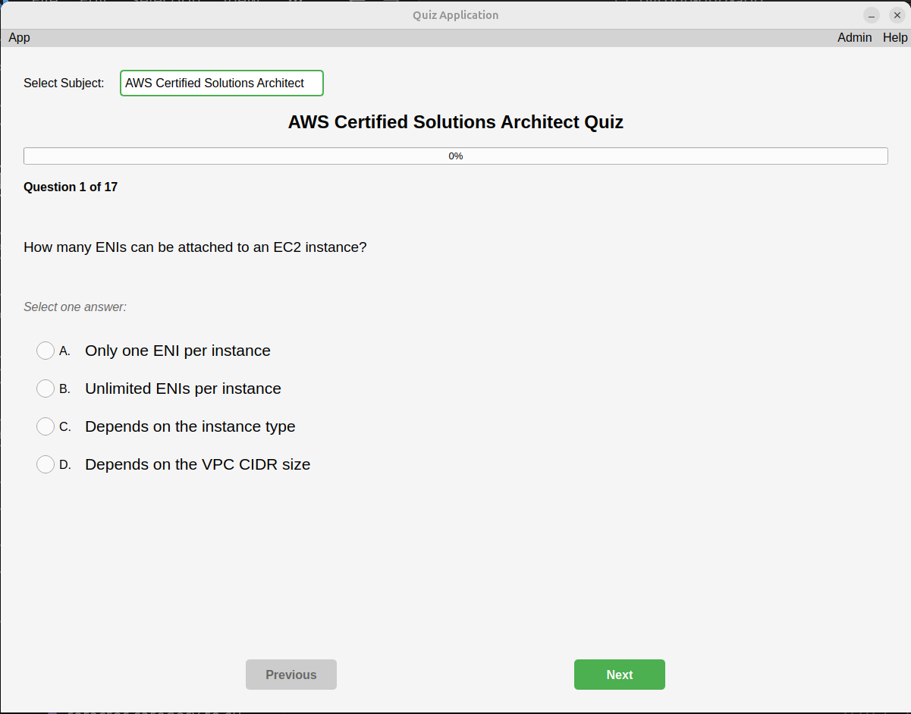
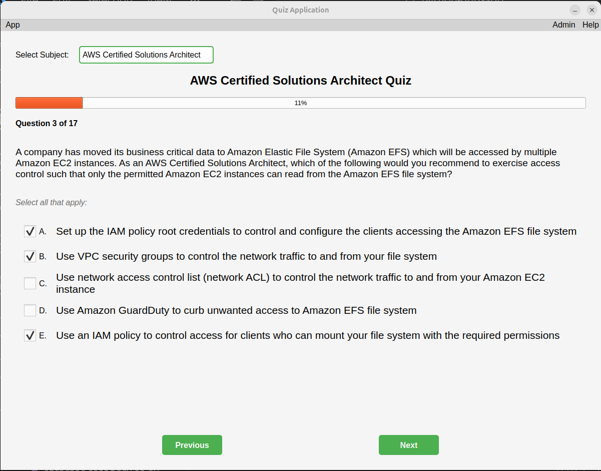
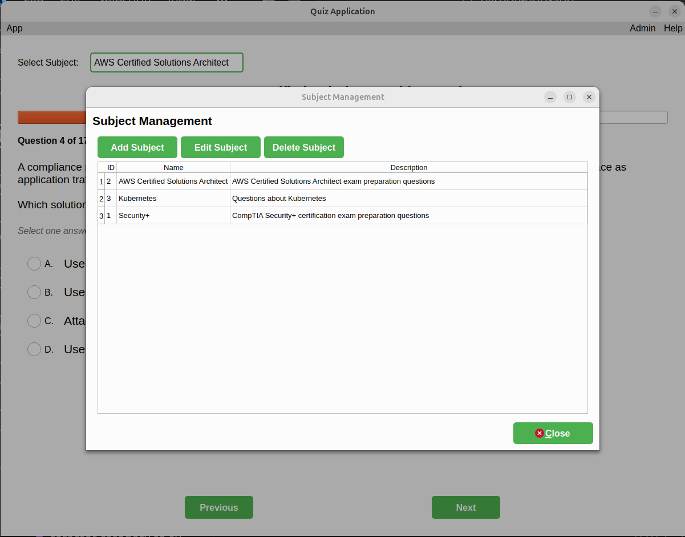
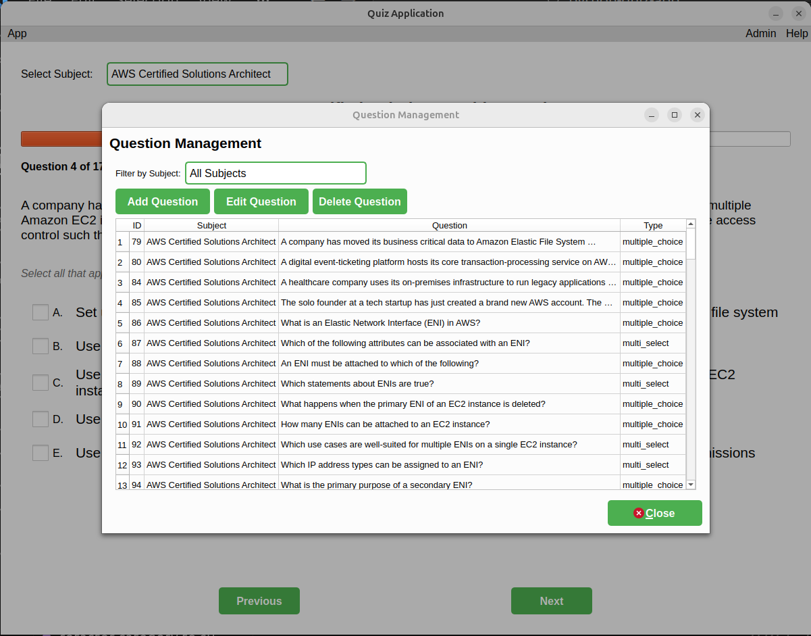
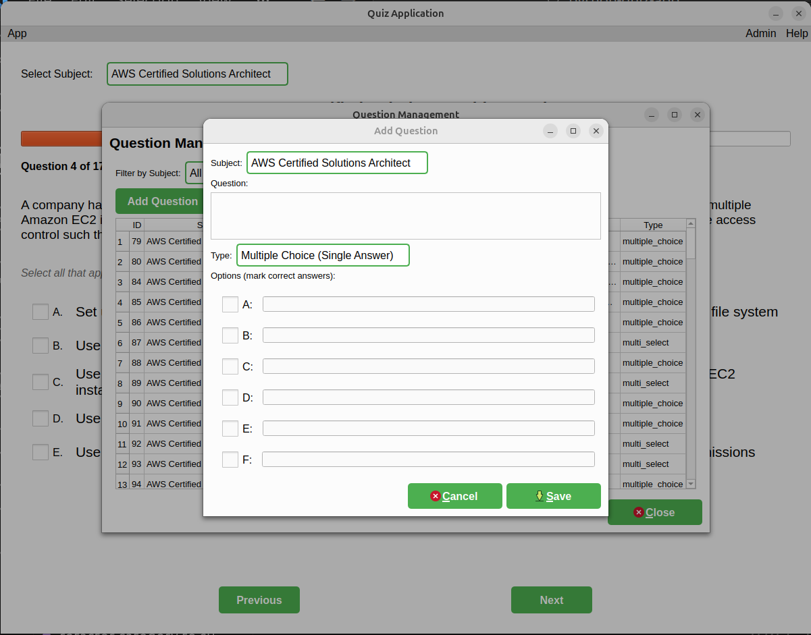
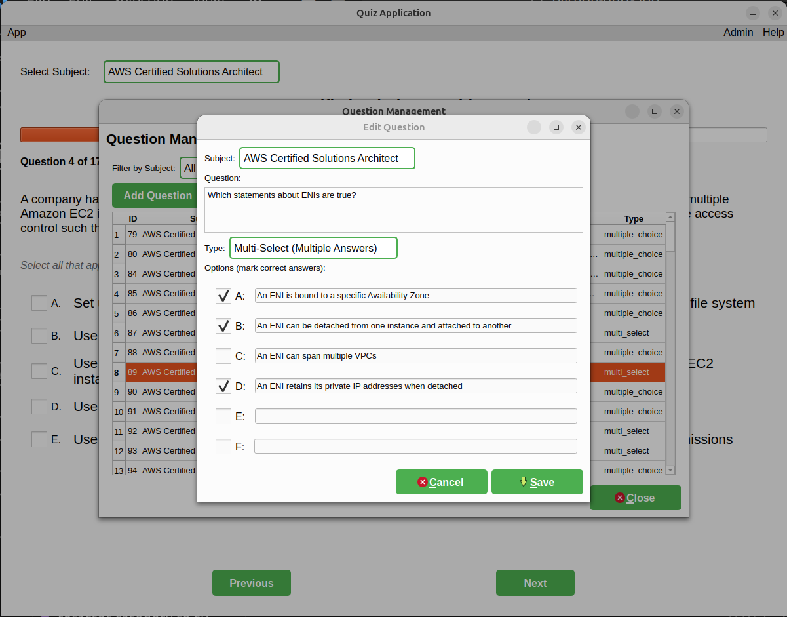

# Quiz Desktop Application

A quiz application with a Graphical User Interface (GUI) using PyQt6 and PostgreSQL database backend.

## Features

- Multiple-choice questions from PostgreSQL database
- Support for single and multi-select questions
- Random question shuffling for each quiz session
- Score tracking and performance feedback
- Modern graphical interface
- PostgreSQL database backend with Docker

### GUI-Specific Features

- **Modern User Interface**: Clean and intuitive design with PyQt6
- **Progress Tracking**: Visual progress bar showing quiz completion
- **Navigation**: Move forward and backward through questions
- **Answer Review**: Review all answers after completing the quiz with color-coded feedback
- **Restart Capability**: Retake the quiz with newly shuffled questions
- **Multi-select Support**: Checkboxes for multi-answer questions, radio buttons for single-answer questions

## Installation

### Prerequisites

- Python 3.8 or higher
- Docker and Docker Compose
- **Linux (Ubuntu/Debian)**: `libxcb-cursor0` — required by Qt 6.5+ for the xcb platform plugin
  ```bash
  sudo apt-get install libxcb-cursor0
  ```
- **macOS**: No additional system dependencies required (Qt uses the native Cocoa plugin)
- **Windows**: No additional system dependencies required (Qt uses the native Win32 plugin)

### Setup

Install Python dependencies:
```bash
pip install -r requirements.txt
```

2. Start PostgreSQL container:
```bash
cd db
docker-compose up -d
cd ..
```

### Usage

```bash
python main.py
```

## Screenshots

**Application Startup**


**Quiz Progress**


**Subject Management**


**Question Management**


**Add Questions**


**Edit Question**


## Database Management

### Start/Stop PostgreSQL

```bash
cd db
docker compose up -d
docker compose down
```

### View Database Logs

```bash
cd db
docker compose logs -f
```

### Connect to Database

```bash
cd db
docker compose exec -it db psql -U quiz_user -d quiz_db
```

### View Database Tables

```bash
quiz_db=# \dt
              List of relations
 Schema |      Name       | Type  |   Owner   
--------+-----------------+-------+-----------
 public | correct_answers | table | quiz_user
 public | options         | table | quiz_user
 public | questions       | table | quiz_user
 public | subjects        | table | quiz_user
(4 rows)
```

## Database Backup and Restore

### Database Backup

```bash
docker compose exec -e PGPASSWORD=quiz_password db pg_dump -U quiz_user -d quiz_db > quiz_backup.sql
```

### Database Restore

```bash
docker compose exec -i db pg_restore -U quiz_user -d quiz_db < quiz_backup.sql
```
